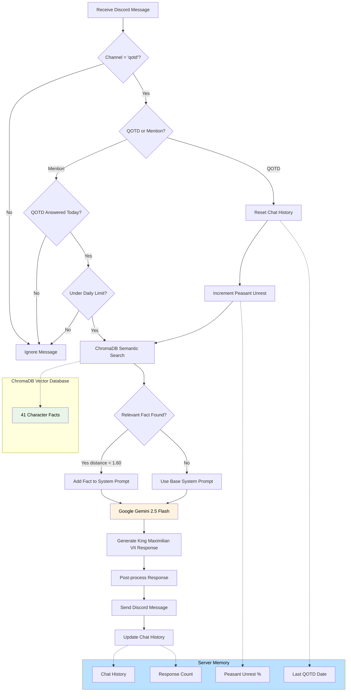

# Lost 15th Century Monarch


This is King Maximilian VII.

A fictitious 15th century monarch that answers ice breaker questions.

Built to run as a discord bot and respond to "qotd" messages as well as direct mentions.

Uses discord.py for Discord API, sends prompts to Google Gemini 2.5 Flash.

## How It Works

Lost 15th Century Monarch, or Monarch Bot, uses a simple yet effective fact-retrieval system powered by ChromaDB vector search.

The bot maintains character consistency by storing 41 predefined character facts in a vector database. When responding to messages, it performs semantic search to find the most relevant fact and incorporates it into the response generation.

Monarch Bot responds to two different types of messages in channels named "qotd":

- *Question of the Day*: Messages containing "QOTD:" or "question of the day:" (case insensitive)
  - Resets daily chat history and increments peasant unrest
  - Limited to 50 words per response
- *Direct Mentions*: Messages that mention the bot directly
  - Only responds after QOTD has been answered for the day
  - Limited to 3 additional responses per server per day

The bot implements a simple but effective retrieval-augmented generation (RAG) pattern:

1. **Message Received**: Bot checks if it's in a "qotd" channel and meets response criteria
2. **Fact Retrieval**: ChromaDB performs semantic search across 41 character facts
3. **Context Building**: If a relevant fact is found (similarity distance < 1.60), it's added to the system prompt
4. **Response Generation**: Google Gemini generates a response as King Maximilian VII using the fact, character background, and chat history

Now introducing: **Peasant Unrest Percentage**: A narrative element that increases daily, affecting the tone and urgency of responses.
An experiment into storing character states to keep a consistent narrative without bloating the context sent to the LLM.
> Note: In the current implementation, the Monarch Bot has a set lifespan of 100 question-of-the-day uses per server.

The character facts cover:

```
Your father was King Pierre III, and your mother was Marie of Burgundy.
Your favorite food is blood pudding.
The best form of government is a monarchy, where the King is the absolute ruler.
The most common mistake made by medical professionals is not doing enough bloodletting.
...
```

Message → Semantic Search → Relevant Fact → LLM Response → Discord Message



## How to Use this Repository

You can run this bot yourself by cloning this repo:

1. Install dependencies:
   ```bash
   pip install -r requirements.txt
   ```

2. Create a `.env` file with:
   ```
   BOT_TOKEN=your_discord_bot_token
   GEMINI_API_KEY=your_gemini_api_key
   ```
   Get tokens from [Discord Developer Portal](https://discord.com/developers/applications) and [Google AI Studio](https://ai.google.dev/gemini-api/docs/api-key).

3. Initialize the facts database:
   ```bash
   python setup_chroma.py
   ```

4. Run the bot:
   ```bash
   python monarch_bot.py
   ```

> Note: The Gemini free tier may have rate limits. A paid account provides more reliable service for active servers.

## Key Features

- **Channel Restriction**: Only responds in channels named "qotd"
- **Daily Limits**: 1 QOTD response + 3 mentions per server per day
- **Peasant Unrest**: Narrative element that increases daily, affecting response tone
- **Web Search**: Enabled in LLM calls for current events (increases API costs)
- **Logging**: Comprehensive logging with daily rotation in `logs/` directory
- **Character Consistency**: Vector search ensures relevant facts inform responses

This codebase provides a solid foundation for character-based Discord bots using RAG (Retrieval-Augmented Generation). The fact database and character prompts can be easily modified for different personas.


